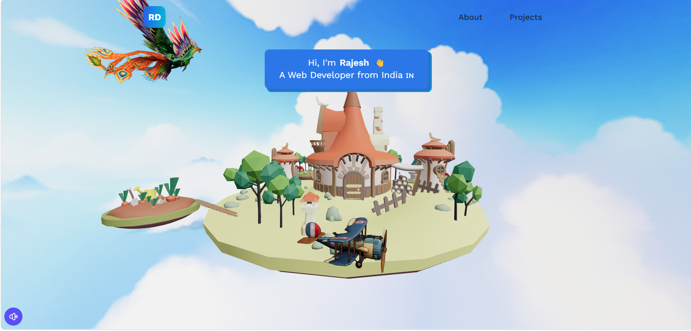

# 🌐 Rajesh D - 3D Portfolio Website

A modern, responsive, and interactive **3D portfolio website** built using **React, Vite, Three.js, React Three Fiber, and Tailwind CSS**. This portfolio showcases my skills, projects, work experience, and contact information through an immersive 3D experience.

## 🚀 Live Demo

🔗 https://your-portfolio.vercel.app

> *(Replace with your Vercel deployment URL after deployment.)*

---

## 📸 Preview

> Add a screenshot of your portfolio here.



---

## ✨ Features

- 🌍 Interactive 3D Landing Page
- 🎨 Smooth Animations
- 🏝️ Draggable 3D Island
- ☁️ Dynamic Rotating Sky
- ✈️ Animated Airplane & Bird
- 📱 Fully Responsive Design
- 💼 Projects Showcase
- 👨‍💻 About Me Section
- 📬 Contact Form with EmailJS
- 🎵 Background Music Toggle
- ⚡ Fast Performance with Vite

---

## 🛠️ Tech Stack

### Frontend

- React.js
- Vite
- JavaScript (ES6+)
- Tailwind CSS

### 3D Technologies

- Three.js
- React Three Fiber
- React Three Drei
- React Spring

### Other Tools

- EmailJS
- Git & GitHub
- Vercel

---

## 📂 Project Structure

```
src/
│── assets/
│── components/
│── constants/
│── hooks/
│── models/
│── pages/
│── App.jsx
│── main.jsx

public/
│── images/
│── videos/
```

---

## ⚙️ Installation

Clone the repository

```bash
git clone https://github.com/RajeshD2004/Portfolio-Website.git
```

Navigate to the project

```bash
cd Portfolio-Website
```

Install dependencies

```bash
npm install
```

Start the development server

```bash
npm run dev
```

Build for production

```bash
npm run build
```

---

## 📁 Environment Variables

Create a `.env` file in the root directory and add your EmailJS credentials.

```env
VITE_APP_EMAILJS_SERVICE_ID=your_service_id
VITE_APP_EMAILJS_TEMPLATE_ID=your_template_id
VITE_APP_EMAILJS_PUBLIC_KEY=your_public_key
```

---

## 📌 Featured Projects

- 🏥 ICU Patient Risk Monitoring System
- 🏏 Cricklytics – Cricket Analytics Platform
- 🛒 BeatMyShop – Product Price Comparison

---

## 📬 Contact

If you'd like to collaborate or discuss opportunities, feel free to connect with me.

📧 Email: your-email@example.com

💼 LinkedIn: https://linkedin.com/in/your-profile

🐙 GitHub: https://github.com/RajeshD2004

---

## ⭐ Support

If you like this project, please consider giving it a ⭐ on GitHub.

---

## 📄 License

This project is licensed under the MIT License.